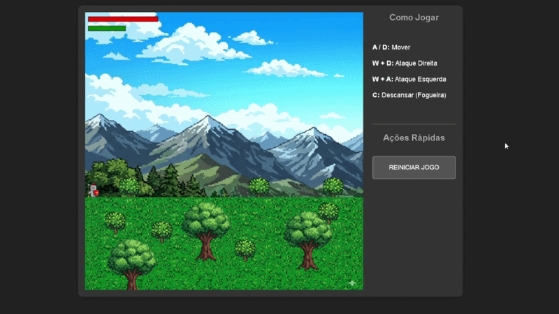

# ⚔️ Tech Souls - Canvas RPG

Um motor de jogo de ação em 2D construído inteiramente com **JavaScript Vanilla** e **Canvas API**. O projeto aplica conceitos de orientação a objetos, máquinas de estado e refatoração modular.
O jogo sofrerá atualizações periodicamente para aportar novas ideias e implementações.

## 🕹️ Demonstração
>


## 🎮 Como Jogar

| Comando | Ação |
| :--- | :--- |
| `A` / `D` | Movimentação Lateral |
| `W + D` | Ataque Forte Direita |
| `W + A` | Ataque Forte Esquerda |
| `C` | Interagir com Fogueira (Salvar/Curar) |

## Como Executar o Projeto

Para garantir que todos os módulos e recursos visuais sejam carregados corretamente, é necessário um servidor local:

1. Clone o repositório ou baixe os arquivos.
2. Certifique-se de que a estrutura de pastas está correta:
   ```text
   /Game_Tech_Souls
   ├── index.html
   ├── images/
   ├── sounds/
   └── js/
       ├── settings.js
       ├── assets.js
       ├── utils.js
       ├── classes.js
       └── main.js
3. Bata abrir o arquivo em seu navegador.
